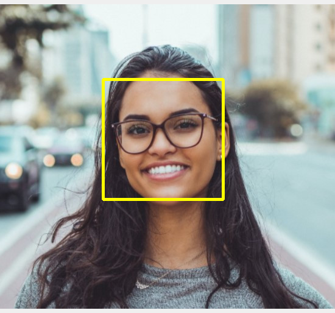

# Detectar Faces

Detecção de faces em imagens usando OpenCV com classificador Haar Cascade.

## Ambiente

```bash
python3 -m venv venv
source detectar-faces/venv/bin/activate
```

## Resultado

| Antes | Depois |
|:-----:|:------:|
|  |  |

Na imagem **Antes** temos a foto original (`person.jpg`). Na imagem **Depois** (`image.png`) o rosto aparece marcado com o retângulo desenhado após a detecção facial.
